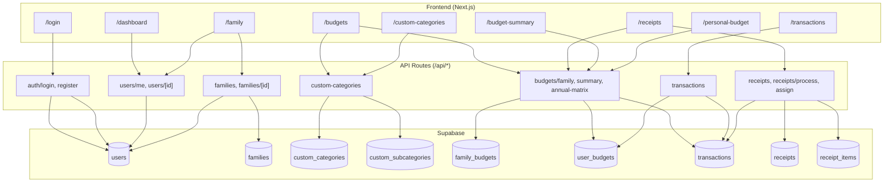

# Domus Plus – Flujo y lógica del sistema

Documento de referencia: rutas, APIs, flujos principales y uso de cada función para analizar el sistema.

---

## Diagrama de flujo general

---

## 1. Overview

- **Frontend:** Next.js (App Router), Supabase client (anon key) para sesión/cookies y algunas lecturas directas.
- **Auth:** Híbrido: las API routes usan Supabase Auth (login/register setean cookies); el frontend además guarda `domus_token` (access_token) y lo envía como `Authorization: Bearer`; axios en `lib/api.ts` usa primero `domus_token`, luego sesión Supabase.
- **Datos:** La mayoría pasan por las API routes de Next.js (`/api/*`); algunas páginas (ej. lista de presupuestos) también leen por cliente Supabase cuando no hay token. El **service role** (admin client) se usa solo en rutas concretas donde hay que saltarse RLS (ver sección 9).

---

## 2. Rutas de la app (páginas en `app/`)

| Ruta | Descripción |
|------|-------------|
| `/` | Redirige a `/login`. |
| `/login` | Formulario de login; llama `/api/auth/login` o `/api/auth/login-demo`, guarda `domus_token`, redirige a `/dashboard`. |
| `/register` | Registro; llama `/api/auth/register` (Supabase Auth + insert en `users`). |
| `/dashboard` | Estadísticas (presupuesto del mes, gastado, recibos pendientes, transacciones recientes) vía `/api/users/me` y `/api/dashboard/stats`. |
| `/family` | Gestionar familia: ver/editar/eliminar familia y miembros; crear familia; crear usuarios (admin); usa `/api/users/me`, `/api/families`, `/api/families/[id]`, `/api/users/create`, `/api/users/[id]`. |
| `/budgets` | Presupuestos familiares: listar/editar, resumen global, matriz anual; usa Supabase `family_budgets` y `/api/custom-categories`, `/api/families`, `/api/budgets/global-summary`, `/api/budgets/annual-matrix`. |
| `/budget-summary` | Resumen por cuenta; usa `/api/users/me`, `/api/budgets/summary`, `/api/budgets/account/[id]`. |
| `/personal-budget` | Presupuestos personales (individuales); usa `/api/users/me`, `/api/personal-budgets`, `/api/personal-budgets/categories`, `/api/receipts/process`, `/api/receipts/[id]/assign`. |
| `/custom-categories` | Gestionar categorías y subcategorías por familia (predefinidas + personalizadas); usa `/api/users/me`, `/api/custom-categories`, `/api/custom-categories/[id]`. |
| `/transactions` | Listar/crear/editar transacciones; opcional subir/procesar recibo; usa `/api/users/me`, `/api/transactions`, `/api/transactions/[id]`, `/api/receipts/process`. |
| `/receipts` | Listar recibos, procesar nuevos, asignar a presupuesto/transacciones; usa `/api/receipts`, `/api/receipts/process`, `/api/receipts/[id]/assign`, `/api/transactions`, `/api/families`, `/api/budgets/family`. |
| `/reports` | Reportes; usa `/api/users/me`, `/api/transactions`, `/api/budgets/family`. |
| `/logs` | Logs de actividad; usa `/api/users/me`, `/api/activity-logs`. |
| `/excel` | Importar presupuestos desde Excel; usa `/api/excel/read`, `/api/excel-import/*`. |
| `/users` | Admin: crear usuarios (familia); usa `/api/users/create`. |
| `/user-records` | Registros de usuario (ej. recibos); usa `/api/users/me`, `/api/receipts`. |
| `/test` | Página de prueba con enlace a login. |

---

## 3. API routes (`app/api/`)

| Path | Método(s) | Propósito | Tablas/funciones principales |
|------|-----------|-----------|-------------------------------|
| `auth/login` | POST | Iniciar sesión; devuelve user + access_token; setea cookies | Supabase Auth, `users` (select/insert), RPC `ensure_user_exists` |
| `auth/register` | POST | Registro; crear usuario en Auth + fila en `users` | Supabase Auth, `users` |
| `auth/login-demo` | POST | Login demo con credenciales de env | Supabase Auth, `users` |
| `users/me` | GET | Perfil del usuario actual | `users` |
| `users/sync` | POST | Asegurar que el usuario de Auth exista en `users` | RPC o insert en `users` |
| `users/verify-password` | POST | Verificar contraseña | Supabase Auth |
| `users/create` | POST | Admin: crear usuario en Auth + `users` | **Service role:** Auth admin, `users` |
| `users/[id]` | GET, PATCH, DELETE | Obtener/actualizar/eliminar miembro (admin en PATCH/DELETE) | `users`; **DELETE** usa **service role** |
| `families` | GET, POST | Listar familia (con miembros) o crear familia | `users`, `families`; **GET** puede usar **service role** si admin (cargar miembros) |
| `families/[id]` | GET, PATCH, DELETE | Obtener/actualizar/eliminar familia (admin en PATCH/DELETE) | `users`, `families` |
| `families/[id]/members` | GET | Listar miembros de la familia | `users` |
| `families/[id]/members/[user_id]` | POST | Añadir miembro a la familia (admin) | `users` |
| `custom-categories` | GET, POST | Listar categorías (seed predefinidas si hace falta) o crear | `custom_categories`, `custom_subcategories`, `users` |
| `custom-categories/[id]` | GET, PUT, DELETE | Obtener/actualizar/eliminar categoría (y subcategorías en PUT) | `custom_categories`, `custom_subcategories` |
| `custom-categories/[id]/subcategories` | POST | Crear subcategoría | `custom_subcategories` |
| `custom-categories/subcategories/[id]` | PUT, DELETE | Actualizar/eliminar subcategoría | `custom_subcategories` |
| `budgets/family` | GET, POST | Listar/crear presupuestos familiares | `users`, `family_budgets`, `user_budgets`, RPC `get_family_budgets_with_calculations` |
| `budgets/family/[id]` | PUT | Actualizar presupuesto familiar (admin) | `family_budgets` |
| `budgets/family/[id]/distribute` | POST | Distribuir presupuesto entre miembros | `family_budgets`, `user_budgets`, `users` |
| `budgets/user` | GET, POST | Listar/crear presupuestos de usuario | `user_budgets`, `family_budgets`, `users` |
| `budgets/summary` | GET | Resumen de presupuestos con gastado | `family_budgets`, `user_budgets`, `transactions`, `users` |
| `budgets/global-summary` | GET | Resumen global por año | `family_budgets`, `user_budgets`, `transactions` |
| `budgets/annual-matrix` | GET | Vista matriz anual | `family_budgets`, `user_budgets`, `transactions` |
| `budgets/account/[id]` | PUT | Actualizar cuenta de presupuesto (admin) | `family_budgets` |
| `budgets/account/[id]/display-names` | PUT | Actualizar nombres mostrados | `family_budgets` |
| `personal-budgets` | GET, POST | Listar/crear presupuestos personales | `family_budgets`, `user_budgets`, `transactions`, `users` |
| `personal-budgets/[id]` | GET, PUT, DELETE | Obtener/actualizar/eliminar presupuesto personal | `family_budgets`, `user_budgets` |
| `personal-budgets/categories` | GET | Categorías para presupuestos personales | `family_budgets`, `user_budgets` |
| `transactions` | GET, POST | Listar/crear transacciones | `transactions`, `family_budgets`, `users`, `user_budgets`, `activity_logs`; **POST** usa **service role** |
| `transactions/[id]` | GET, PUT | Obtener/actualizar transacción; actualizar montos gastados | `transactions`, `user_budgets`, `activity_logs`; **PUT** usa **service role** |
| `receipts` | GET | Listar recibos (con items) | `receipts`, `receipt_items` |
| `receipts/[id]` | GET | Un recibo con items | `receipts`, `receipt_items` |
| `receipts/process` | POST | OCR: procesar recibo, guardar recibo + items | `users`, `receipts`, `receipt_items` |
| `receipts/[id]/assign` | POST | Asignar recibo a presupuesto y crear transacciones | `receipts`, `family_budgets`, `users`, `transactions` |
| `receipts/[id]/items` | POST | Añadir item al recibo | `receipts`, `receipt_items` |
| `receipts/items/[id]/assign` | PUT | Asignar item a transacción | `receipt_items`, `receipts`, `family_budgets`, `transactions`, `user_budgets` |
| `activity-logs` | GET | Listar logs (alcance familia para admin) | `activity_logs`, `users` |
| `activity-logs/stats` | GET | Estadísticas de actividad | `activity_logs` |
| `dashboard/stats` | GET | Agregados del dashboard | `users`, `family_budgets`, `transactions`, `receipts` |
| `health` | GET | Health check | — |
| `excel/read`, `excel/preview` | POST | Leer / previsualizar Excel | — |
| `excel-import/parse-budgets` | POST | Parsear presupuestos desde Excel | Session, `users` |
| `excel-import/import-budgets` | POST | Importar presupuestos (admin); puede crear familia | `family_budgets`, `user_budgets`, RPC `assign_family_admin`, `users` |
| `excel-import/setup-from-excel` | POST | Setup desde Excel (admin) | `users`, lógica familias/presupuestos |
| `ai-assistant/*` | POST | Chat, analizar presupuesto, optimizar, reporte, predicción, sugerir categoría, anomalías | Session |
| `whatsapp/webhook` | POST | Webhook WhatsApp | `users`, lógica recibos/transacciones |
| `dev/load-test-data`, `dev/clear-test-data`, `dev/delete-all-transactions` | POST | Cargar/limpiar datos de prueba | — |

---

## 4. Flujo de autenticación (login, sesión, tokens)

- **Login:**  
  - El formulario envía a `POST /api/auth/login` (email/password).  
  - El servidor usa Supabase `signInWithPassword`, asegura fila en `users` (RPC `ensure_user_exists` o insert), comprueba `is_active`.  
  - Respuesta: `{ user, access_token }`. El frontend guarda `access_token` en `localStorage` como `domus_token` y puede llamar a `supabase.auth.signInWithPassword` para cookie/sesión.  
- **Login demo:**  
  - `POST /api/auth/login-demo` con env `DEMO_EMAIL`/`DEMO_PASSWORD`; setea cookies; no devuelve access_token en el body (sesión por cookies).  
  - Tras éxito, el frontend puede llamar a `POST /api/users/sync`.  
- **Registro:**  
  - `POST /api/auth/register`: Supabase `signUp` + insert en `users` (sin familia).  
- **Sesión:**  
  - Las API routes usan `createClient(request)` (cliente Supabase del servidor) con cookies y/o `Authorization: Bearer <token>`.  
  - Frontend: el interceptor en `lib/api.ts` envía `Authorization: Bearer domus_token` si existe, si no el access_token de `getSession()` de Supabase.  
- **Funciones clave en frontend:**  
  - `loginViaApi()` → `POST /api/auth/login`, guarda `domus_token`.  
  - `fetch('/api/users/me')` para comprobar sesión y redirigir si no hay login.  
  - `getAuthHeaders()` / `getToken()` (localStorage o sesión Supabase) para llamar al resto de APIs.

---

## 5. Flujo Familia / miembros

- **Frontend:**  
  - **Página Familia:** `loadUser()` → `GET /api/users/me`; `loadFamily()` → `GET /api/families`; crear → `POST /api/families`; editar/eliminar → `PATCH/DELETE /api/families/[id]`; crear usuario → `POST /api/users/create`; editar/eliminar miembro → `PATCH/DELETE /api/users/[id]`.  
  - **Presupuestos:** `loadUser()`, `loadFamilyMembers(familyId)` → `GET /api/families` (con auth headers).  
  - **Recibos:** `loadFamilyMembers(token, family_id)` → `GET /api/families/[id]/members`.  
- **APIs:**  
  - `GET /api/families`: familia del usuario con miembros; si es admin de familia puede usar **service role** para cargar `families` + `users` (miembros) y evitar límites de RLS.  
  - `POST /api/families`: crear familia, poner usuario actual como admin, asignar `family_id`.  
  - `GET/PATCH/DELETE /api/families/[id]`: exigen que el usuario pertenezca a esa familia; PATCH/DELETE exigen `is_family_admin`.  
  - `GET /api/families/[id]/members`: listar miembros por `family_id`.  
  - `POST /api/families/[id]/members/[user_id]`: añadir miembro (setear `family_id`); solo admin.  
  - `POST /api/users/create`: solo admin; **service role** para crear usuario en Auth e insertar en `users` con `family_id`.  
  - `PATCH /api/users/[id]`: solo admin; actualizar miembro.  
  - `DELETE /api/users/[id]`: solo admin; **service role** para limpiar `family_id` e `is_family_admin` (y comprobar “al menos un admin”, etc.).

---

## 6. Flujo Presupuestos (crear, listar, categorías)

- **Categorías:**  
  - `GET /api/custom-categories`: listar por `family_id`, y si hace falta hacer seed de predefinidas (`custom_categories`, `custom_subcategories`).  
  - Crear/actualizar/eliminar vía `POST/PUT/DELETE` en rutas de custom-categories y subcategorías.  
- **Presupuestos familiares:**  
  - Listar: `GET /api/budgets/family?year=` (usa RPC `get_family_budgets_with_calculations` si existe, si no `family_budgets` + `user_budgets`).  
  - Crear: `POST /api/budgets/family`.  
  - Actualizar: `PUT /api/budgets/family/[id]`, `PUT /api/budgets/account/[id]`, `PUT /api/budgets/account/[id]/display-names`.  
  - Distribuir: `POST /api/budgets/family/[id]/distribute`.  
- **Presupuestos personales:**  
  - `GET/POST /api/budgets/user`; `GET/POST /api/personal-budgets`; `GET /api/personal-budgets/categories`; `GET/PUT/DELETE /api/personal-budgets/[id]`.  
- **Resúmenes:**  
  - `GET /api/budgets/summary`, `GET /api/budgets/global-summary`, `GET /api/budgets/annual-matrix`.  
- **Funciones clave en frontend:**  
  - **Presupuestos:** `loadUser()`, `loadCustomCategories()` → `GET /api/custom-categories`, `loadFamilyMembers()` → `GET /api/families`, `loadBudgets()` (Supabase `family_budgets` directo o API), `loadGlobalSummary()` → `GET /api/budgets/global-summary`, `loadAnnualMatrix()` → `GET /api/budgets/annual-matrix`, `handleCreateBudget` (crea en Supabase/API y `user_budgets`).  
  - **Resumen presupuesto:** `loadUser()` → `GET /api/users/me`, `loadSummary()` → `GET /api/budgets/summary`, actualizar cuenta → `PUT /api/budgets/account/[id]`.  
  - **Presupuesto personal:** `loadUser()` → `GET /api/users/me`, `loadBudgets()` → `GET /api/personal-budgets`, categorías → `GET /api/personal-budgets/categories`, crear/actualizar/eliminar → `POST/PUT/DELETE /api/personal-budgets` y `[id]`.  
  - **Categorías:** `loadUser()` → `GET /api/users/me`, listar/crear/actualizar → `GET/POST /api/custom-categories`, `GET/PUT/DELETE /api/custom-categories/[id]`.

---

## 7. Flujo Transacciones

- **Listar:** `GET /api/transactions` (params: category, transaction_type, start_date, end_date, limit, offset).  
- **Crear:** `POST /api/transactions` (body: amount, family_budget_id, date, etc.); el servidor crea la transacción y actualiza `user_budgets.spent_amount`; se usa **service role** para que los writes no fallen por RLS.  
- **Actualizar:** `PUT /api/transactions/[id]`; el servidor ajusta montos gastados del presupuesto antiguo/nuevo y actualiza `user_budgets` y `activity_logs`; se usa **service role**.  
- **Funciones clave en frontend:**  
  - **Página Transacciones:** `loadUserSupabase()` → `GET /api/users/me`, `loadTransactionsSupabase()` / `loadTransactions()` → `GET /api/transactions`, crear → `POST /api/transactions`, editar → `PUT /api/transactions/[id]`, subir recibo → `POST /api/receipts/process`.  
  - **Recibos:** `loadTransactions()` → `GET /api/transactions`.

---

## 8. Flujo Recibos

- **Listar:** `GET /api/receipts` (skip, limit, status).  
- **Un recibo:** `GET /api/receipts/[id]`.  
- **Procesar (OCR):** `POST /api/receipts/process` (multipart con imagen); asegura usuario en `users`, crea `receipts` + `receipt_items`.  
- **Asignar recibo a presupuesto:** `POST /api/receipts/[id]/assign` (family_budget_id, assign_to_all o target_user_id); actualiza estado del recibo y crea `transactions`.  
- **Items:** `POST /api/receipts/[id]/items` (añadir item); `PUT /api/receipts/items/[id]/assign` (asignar item a transacción).  
- **Funciones clave en frontend:**  
  - **Página Recibos:** `loadUserSupabase()` → `GET /api/users/me`, `loadReceipts()` → `GET /api/receipts`, `loadTransactions()` → `GET /api/transactions`, `loadFamilyMembers()` → `GET /api/families/[id]/members`, `loadBudgets()` → `GET /api/budgets/family`, procesar → `POST /api/receipts/process`, asignar → `POST /api/receipts/[id]/assign`, obtener recibo → `GET /api/receipts/[id]`, asignar item → `PUT /api/receipts/items/[id]/assign`, añadir item → `POST /api/receipts/[id]/items`.  
  - **Presupuesto personal / transacciones:** procesar recibo → `POST /api/receipts/process`, asignar → `POST /api/receipts/[id]/assign`.

---

## 9. RLS y service role (admin client)

- **Por defecto:** Las API routes usan `createClient(request)` (Supabase con anon key y contexto del usuario por cookie/Authorization). RLS se aplica.  
- **Service role** (`SUPABASE_SERVICE_ROLE_KEY`) se usa solo donde el servidor debe saltarse RLS o usar Auth Admin:

| Dónde | Por qué |
|-------|---------|
| **POST /api/transactions** | Insertar transacción y actualizar `user_budgets.spent_amount` (y activity_logs) sin que RLS bloquee en esas tablas. |
| **PUT /api/transactions/[id]** | Actualizar transacción y recalcular/actualizar `user_budgets` del presupuesto antiguo/nuevo y escribir `activity_logs`. |
| **GET /api/families** | Cuando el usuario es `is_family_admin`, usar admin client para cargar familia con miembros (`families` + `users`) si RLS impide leer otros miembros. |
| **POST /api/users/create** | Crear usuario en Supabase Auth (`admin.auth.createUser`) e insertar en `users` con `family_id` (RLS podría bloquear el insert). |
| **DELETE /api/users/[id]** | Poner `family_id` e `is_family_admin` del usuario objetivo (ej. sacarlo de la familia); asegurar que quede al menos un admin; saltarse RLS para estas actualizaciones. |

El resto de rutas usan el cliente Supabase normal (RLS aplicado).

---

## 10. Referencia rápida

### APIs por área

| Área | Métodos | Endpoints |
|------|---------|-----------|
| Auth | POST | `/api/auth/login`, `/api/auth/register`, `/api/auth/login-demo` |
| Usuario | GET | `/api/users/me` |
| Usuario | POST | `/api/users/sync`, `/api/users/verify-password`, `/api/users/create` |
| Usuario | GET, PATCH, DELETE | `/api/users/[id]` |
| Familia | GET, POST | `/api/families` |
| Familia | GET, PATCH, DELETE | `/api/families/[id]` |
| Familia | GET | `/api/families/[id]/members` |
| Familia | POST | `/api/families/[id]/members/[user_id]` |
| Categorías | GET, POST | `/api/custom-categories` |
| Categorías | GET, PUT, DELETE | `/api/custom-categories/[id]`, subcategorías |
| Presupuestos | GET, POST | `/api/budgets/family`, `/api/budgets/user`, `/api/personal-budgets` |
| Presupuestos | GET | `/api/budgets/summary`, `/api/budgets/global-summary`, `/api/budgets/annual-matrix` |
| Presupuestos | PUT, POST | `/api/budgets/family/[id]`, `/api/budgets/account/[id]`, distribute, personal-budgets/[id] |
| Transacciones | GET, POST | `/api/transactions` |
| Transacciones | GET, PUT | `/api/transactions/[id]` |
| Recibos | GET | `/api/receipts`, `/api/receipts/[id]` |
| Recibos | POST | `/api/receipts/process`, `/api/receipts/[id]/assign`, `/api/receipts/[id]/items` |
| Recibos | PUT | `/api/receipts/items/[id]/assign` |
| Otros | GET | `/api/dashboard/stats`, `/api/activity-logs`, `/api/activity-logs/stats`, `/api/health` |

### Funciones principales del frontend y APIs que llaman

| Función | Página(s) | APIs que llama |
|---------|-----------|-----------------|
| `loginViaApi` | login | `POST /api/auth/login` |
| `loadUser` / `loadUserSupabase` | budgets, family, receipts, transactions, custom-categories, reports, logs, budget-summary, personal-budget, dashboard, excel, user-records | `GET /api/users/me` |
| `loadFamily` | family | `GET /api/families` |
| `loadFamilyMembers` | budgets, receipts | `GET /api/families` o `GET /api/families/[id]/members` |
| `loadCustomCategories` | budgets, custom-categories | `GET /api/custom-categories` |
| `loadBudgets` | budgets, receipts, personal-budget | Supabase `family_budgets` y/o `GET /api/budgets/family`, `GET /api/personal-budgets` |
| `loadGlobalSummary` | budgets | `GET /api/budgets/global-summary` |
| `loadAnnualMatrix` | budgets | `GET /api/budgets/annual-matrix` |
| `loadTransactions` | receipts, transactions | `GET /api/transactions` |
| `loadReceipts` | receipts, user-records | `GET /api/receipts` |
| `loadSummary` | budget-summary | `GET /api/budgets/summary` |
| Crear familia | family, budgets | `POST /api/families` |
| Crear usuario | family, users | `POST /api/users/create` |
| Editar/eliminar miembro | family | `PATCH/DELETE /api/users/[id]` |
| Editar/eliminar familia | family | `PATCH/DELETE /api/families/[id]` |
| Crear/actualizar transacción | transactions, receipts | `POST /api/transactions`, `PUT /api/transactions/[id]` |
| Procesar recibo | receipts, transactions, personal-budget | `POST /api/receipts/process` |
| Asignar recibo | receipts, personal-budget | `POST /api/receipts/[id]/assign`, `PUT /api/receipts/items/[id]/assign` |

---

## 11. Tablas principales de Supabase

| Tabla | Uso |
|-------|-----|
| `users` | Usuarios de la app; `family_id`, `is_family_admin`, `is_active`. |
| `families` | Familias; `admin_id`, nombre, dirección. |
| `custom_categories` | Categorías por familia; `is_predefined` para las sembradas. |
| `custom_subcategories` | Subcategorías de cada categoría. |
| `family_budgets` | Presupuestos familiares; categoría/subcategoría o custom_category_id; montos, año. |
| `user_budgets` | Asignación por usuario a un presupuesto familiar; `allocated_amount`, `spent_amount`. |
| `transactions` | Movimientos; vinculados a `family_budget_id`, usuario, monto, fecha. |
| `receipts` | Recibos (imagen, monto, comercio, etc.). |
| `receipt_items` | Líneas de cada recibo. |
| `activity_logs` | Log de actividad (quién hizo qué). |

Si quieres profundizar en un flujo concreto (por ejemplo solo recibos o solo presupuestos), se puede extraer de este documento una sección más detallada.
